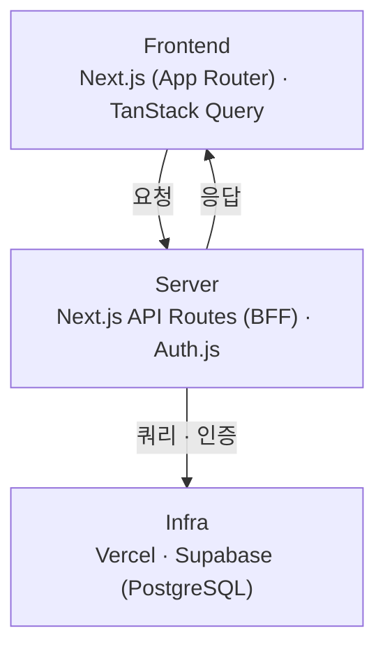
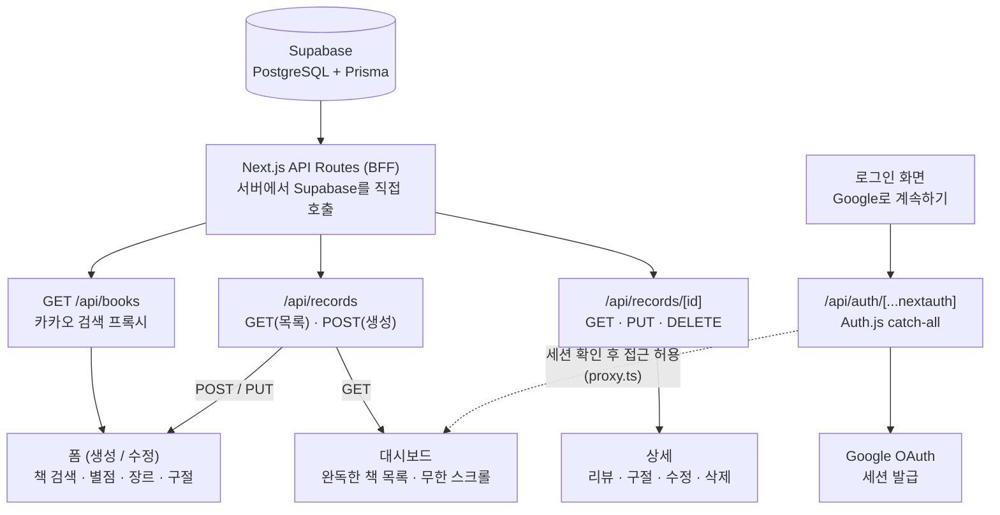

## 시작하기

```bash
pnpm i
pnpm dev
```

## 바로가기

https://book-book-book-two.vercel.app/

## 아키텍처



<details>
<summary>API/화면 상세 구조 보기</summary>



</details>

## 프로젝트 개요

**book-book-book**은 완독한 책을 기록하고, 인상 깊었던 구절을 남기는 개인 독서 기록 앱입니다.

Claude는 페어 프로그래밍 도구로 활용해 백엔드 구현과 UI 디자인을 담당하고 저는 전체 설계 방향 결정과 화면 구성 기획 프론트엔드 개발을 진행하고 셀프 피드백과 리팩터링을 담당했습니다. 데이터 모델 설계(정규화 여부, 필드 소속 결정) 타입 경계 설계(외부 API 응답과 도메인 모델 분리) 캐싱 전략 같은 부분에 대해 여러 대안을 상정해 놓고 트레이드오프를 따져 결정하는 방식으로 개발을 진행했습니다.

**Tech Stack**: Next.js (App Router) · TypeScript · TanStack Query · Prisma · PostgreSQL (Supabase) · Auth.js · Tailwind CSS

## 주요 기능

### 도서 검색 (AutoComplete)

- 입력 디바운싱과 `AbortController`를 이용한 이전 요청 취소로 불필요한 API 호출 최소화
- 검색 결과 상태(초기/빈 결과/목록)를 별도 컴포넌트로 분리해 각 상태의 렌더링 책임을 명확히 함

### 무한 스크롤 대시보드

- Cursor 기반 페이지네이션(`nextCursor`)으로 목록 API 구현
- `useSuspenseInfiniteQuery` + `IntersectionObserver`로 스크롤 시 다음 페이지 자동 로딩 구현

### 기록 작성/수정 폼

- `react-hook-form` 기반으로 네이티브 입력 요소는 `register`를 통한 비제어 방식을 사용했습니다. 그리고 커스텀 UI(별점, 책 선택 등)는 제어방식인 `Controller`로 구분해 연결을 관리했습니다.
- 필사 구절은 `useFieldArray`를 통해 동적으로 폼을 관리

### 인증

- Auth.js(NextAuth) 기반 Google 소셜 로그인, JWT 세션 방식 채택
- Next.js 미들웨어(proxy)로 인증되지 않은 사용자의 페이지 접근을 요청 단계에서 차단
- 모든 API Route Handler에서 세션 검증을 이중으로 수행하여, 미들웨어 우회 가능성에 대비

## 겪었던 문제와 해결

**캐시 갱신 타이밍**

기록 수정 후 상세 화면으로 이동해도 변경 내용이 반영되지 않는 문제가 있었습니다. Route Handler 캐싱, staleTime 설정, 리소스 id 불일치 등 여러 가설을 하나씩 검증하며 배제해나갔고, 최종적으로 mutation 함수 내부에서 비동기 요청의 반환값이 누락되어 실제 서버 응답보다 완료 시점이 앞서 처리되는 race condition이 원인임을 확인해 해결했습니다.

**외부 API 응답과 도메인 타입의 분리**

카카오 API의 응답 형식(`thumbnail`, `datetime` 등)을 도메인 타입에 그대로 사용하면서, 생성 화면과 수정 화면에서 같은 필드가 서로 다른 형태(원본 문자열 vs. 가공된 값)로 흘러 들어와 버그가 발생했습니다. 이를 계기로 BFF 계층에서 외부 응답을 도메인 전용 타입으로 변환하는 경계를 명확히 정의했고, 이후 도메인 로직이 외부 API의 응답 형식 변화로부터 독립적으로 유지되도록 구조를 개선했습니다.

## 추가할 기능

**UI개선**
현재 Dashboard에는 UI방식이 리스트를 보여주는 형식만 되어 있습니다. 추후에는 장르, 별점 등을 통해 sorting이 가능한 리스트 기능을 추가하고 리스트를 보이는 방식 말고 커버 플로우 방식을 추가해 다양한 형태의 책 목록을 확인할 수 있도록 변경할 예정입니다.

**데일리 랜덤 필사 기능 추가**
책을 읽고 감명깊었던 구절을 적는 기능이 있습니다. 이를 활용하여 구절을 랜덤으로 필사 할 수 있는 화면을 추가할 예정입니다.

**혼자만의 챌린지 기능 추가**
챌린지 기간을 설정하고 그 동안 읽을 책 권수를 정해 도전하는 방식의 셀프 챌린지 기능을 넣을 예정입니다.

**한달 책 통계 기능 추가**
한달동안 몇권의 책을 읽었고, 그 책들의 장르 평점 저자 출판사에 대한 통계기능을 제공할 예정입니다.
